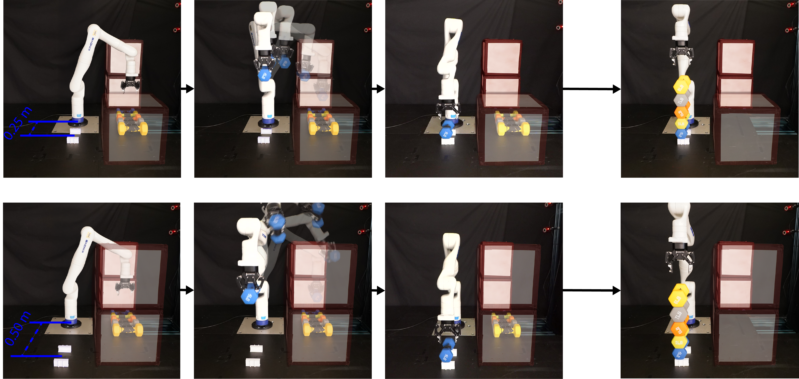
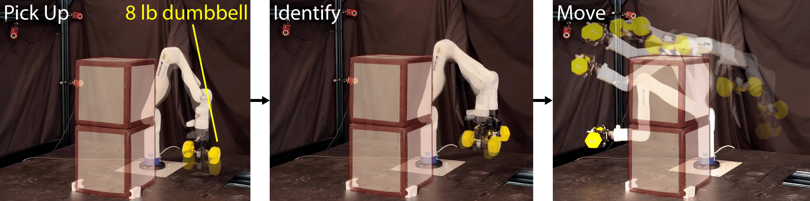

# Provably-Safe, Online System Identification

## Overview

This repository hosts the code to reproduce the results in our paper "Provably-Safe, Online System Identification" on Kinova-Gen3 arm.

As shown in `.gitmodules`, this repository is essentially a docker container that includes two modules:
1. [kinova_robust_control](https://roahmlab.github.io/kinova_robust_control/): robust controller for hardware Kinova-Gen3.
2. [RAPTOR](https://roahmlab.github.io/RAPTOR/): trajectory optimization and system identification related code.

Readers are welcome to refer to the introduction in kinova_robust_control's [README](https://github.com/roahmlab/kinova_robust_control/blob/humble/README.md) for more information on the robust controller and the hardware interface,
and the introduction in RAPTOR's [README](https://github.com/roahmlab/RAPTOR/tree/main/Examples/Kinova/SystemIdentification) for more information on provably-safe exciting trajectory optimization and robust system identification for unknown payloads.

## Introduction

Precise manipulation tasks require accurate knowledge of payload inertial parameters.
Unfortunately, identifying these parameters for unknown payloads while ensuring that the robotic system satisfies its input and state constraints while avoiding collisions with the environment remains a significant challenge.
This paper presents an integrated framework that enables robotic manipulators to safely and automatically identify payload parameters while maintaining operational safety guarantees. 
The framework consists of two synergistic components: 
1. an online trajectory planning and control framework that generates provably-safe exciting trajectories for system identification that can be tracked while respecting robot constraints and avoiding obstacles
2. a robust system identification method that computes rigorous overapproximative bounds on end-effector inertial parameters assuming bounded sensor noise. 

Experimental validation on a robotic manipulator performing challenging tasks with various unknown payloads demonstrates the framework's effectiveness in establishing accurate parameter bounds while maintaining safety throughout the identification process.

This repository contains the implementation and scripts needed to reproduce the key experiments presented in our paper:

**Experiments (a) and (b)**: A manipulation task where the robot must safely pick up and stack a series of heavy unknown dumbbells onto a specific location.


**Experiment (c)**: A more challenging scenario where the robot picks up the heaviest dumbbell (8lb) and follows a predefined trajectory to avoid obstacles in a more challenging setting .


## Installation

This repository includes a [Dockerfile](docker/Dockerfile) that installs all necessary dependencies.

> Need Docker? Follow the [official instructions](https://docs.docker.com/engine/install/ubuntu/#install-using-the-repository).

### 1. Clone the Docker Repository (with Submodules)

```bash
git clone --recurse-submodules https://github.com/roahmlab/OnlineSafeSysID.git
```

### 2. Update `kinova_robust_control` and `RAPTOR` (Optional)

```bash
git submodule update --init --recursive
```

### 3. Get HSL

We have selected [HSL](https://www.hsl.rl.ac.uk/) to solve large linear systems in the nonlinear optimization problem in RAPTOR. 
Please follow the instructions in HSL section of the [README](https://github.com/roahmlab/RAPTOR/blob/main/Installation/README.md) in RAPTOR to access HSL package and integrate in this container properly.

### 4. Build the Docker Container in VS Code

1. Open VS Code.
2. Press `Ctrl+Shift+P` and search for: `Dev Containers: Rebuild and Reopen Container`.
3. Select it to automatically build the container using the provided Dockerfile.

### 5. Build `kinova_robust_control`

Inside the container (`/workspaces/OnlineSafeSysID`), run the following to build the repository:

```bash
colcon build --cmake-args -DCMAKE_BUILD_TYPE=Release
```

### 6. Build `RAPTOR`

Since this command does not include pybind programs inside RAPTOR, you will have to go inside RAPTOR and build the code again:

```bash
cd src/RAPTOR
mkdir build
cd build
cmake ..
make -j4
```

### 7. Other Notes
**Every time you open a new terminal, you need the following command to load all ros2 environment variables in order**:

```bash
source install/setup.bash
```

Note that you may have to remove all previous compiled objects if you make changes to the dockerfile and rebuild the docker container:

```bash
rm -rf build install devel
```

Please save important files or folders before you do this.

For more information on installation, please visit [README](https://github.com/roahmlab/kinova_robust_control/blob/humble/installation/README.md) in kinova_robust_control.

## Run the Demo

### Experiment Settings
Just for the safety of the arm, make sure that there are no obstacles around the arm before trying anything.
Add obstacles as defined in line 37-43 of [run_online_sysid_demo.py](src/kinova_robust_control/experiments/scripts/run_online_sysid_demo.py) later when you are sure that the system is stable.

Put dumbbells at specific locations, defined in `self.pick_pos` variable (line 159-174) of [run_online_sysid_demo.py](src/kinova_robust_control/experiments/scripts/run_online_sysid_demo.py).
Note that the original gripper of Kinova is not strong enough to hold dumbbells over 7lb stably. 
You might need some tapes around the gripper or the dumbbell to increase the friction coefficients to ensure stable grasping.


### Run the Demo
First, run the following ros2 command in a separate terminal (`/workspaces/OnlineSafeSysID/`) before running any of the scripts.
```shell
ros2 run kortex control_system --ros-args --params-file ./config.yaml
```
Note that this will first move the arm to `init_pos` defined in [config.yaml](config.yaml) and the start the robust controller instance.

Launch the script in another terminal using:
```shell
ros2 run experiments run_online_sysid_demo.py
```
This will start the experiment.

## Authors

This work is developed in [ROAHM Lab](https://www.roahmlab.com/). 

[Bohao Zhang](https://cfather.github.io/) (jimzhang@umich.edu)

Zichang Zhou

[Ram Vasudevan](https://www.roahmlab.com/ram-personal)


